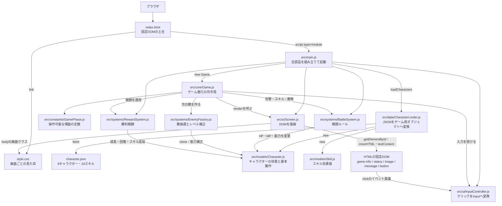
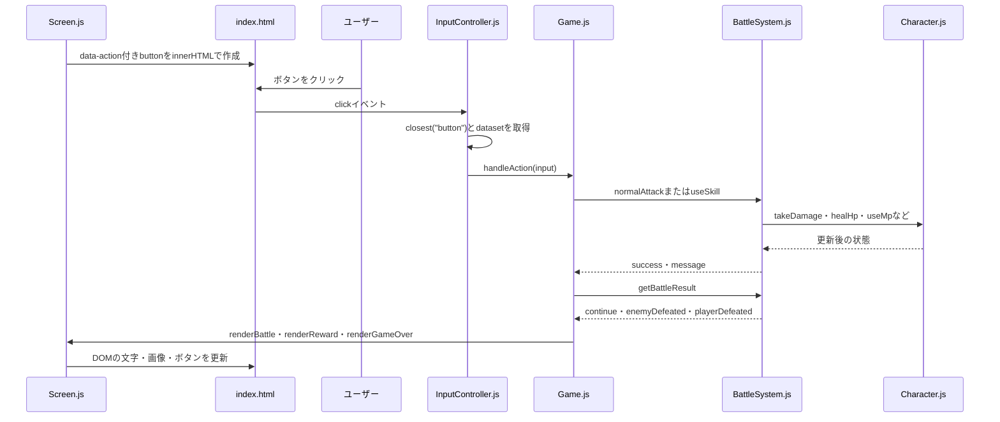
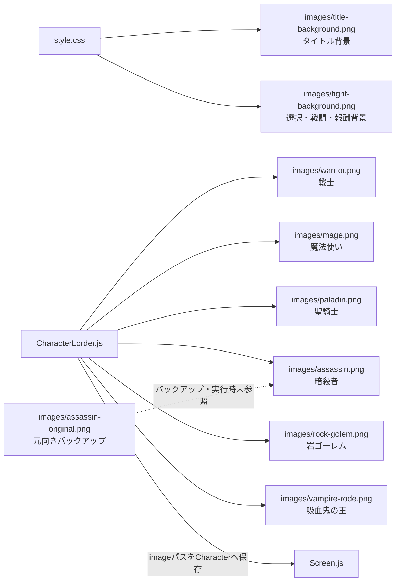
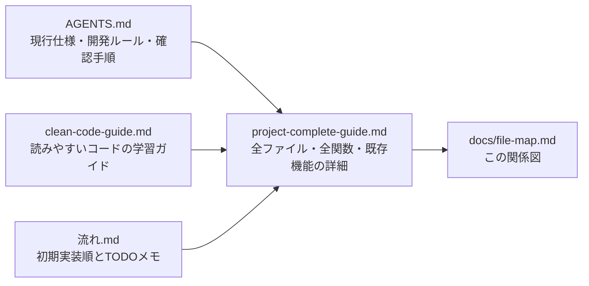

# yuiyuiRPG ファイル関係図

この図は、現在のプロジェクトに存在するソースコード、データ、画像、開発文書の関係を表します。

## 実行時の流れ

## ボタンを押してから画面が更新されるまで

## 画像ファイル

## 学習・開発用文書

詳しい引数の出どころ、全メソッドの呼び出し元、`getElementById()`、`dataset`、`fetch()` などの説明は、ルートにある [`project-complete-guide.md`](../project-complete-guide.md) を参照してください。
